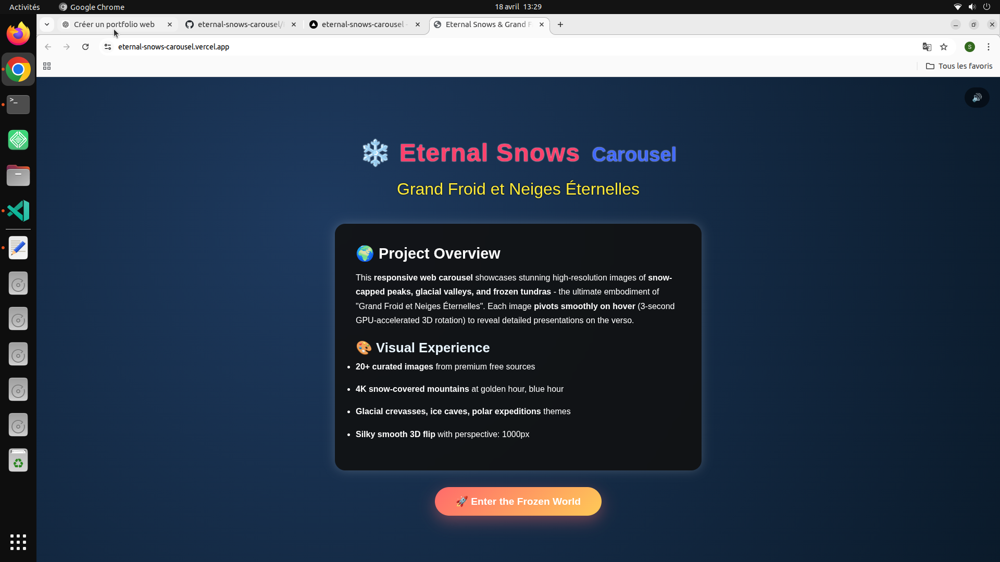

# 🌌 Eternal Snows Carousel

A cinematic and immersive 3D experience inspired by glaciers, polar landscapes, and extreme frozen environments.

Each card reveals a visual and poetic journey through eternal snow, enhanced with smooth animations and atmospheric effects.

---

## 🔗 Live Demo
https://eternal-snows-carousel.vercel.app

## 📂 GitHub Repository
https://github.com/saidhadjadj/eternal-snows-carousel

---

## 🌍 Overview
Eternal Snows is a responsive interactive carousel showcasing high-resolution images of snow-covered mountains, glacial valleys, and arctic landscapes.

Designed as a visual storytelling experience, it combines motion, atmosphere, and UI design to create a calm and immersive environment.

---

## ✨ Features
- 🏔️ 20+ high-quality images (Unsplash & Pexels)
- 🔄 Smooth 3D animations
- 🌨️ Dynamic snowfall effect
- 🎨 Glassmorphism UI
- 📱 Fully responsive
- ⚡ Optimized performance

---

## 📸 Preview

---

## 🛠️ Tech Stack
- HTML5
- CSS3 (animations, 3D transforms)
- JavaScript (ES6)

---

## 🎯 Purpose
This project explores advanced UI design, animation techniques, and immersive visual storytelling.

---

## 👤 Author
Said Hadjadj
